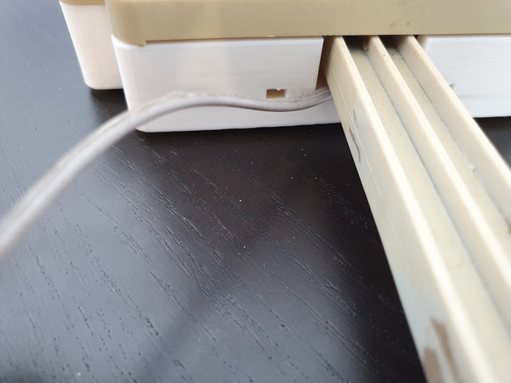

# Deploying Weather Station

---

The final step is deploying the weather station being very important to ensure that solar panel is pointed to south. This will ensure it will collect more energy. It is also important to check the orientation of the wind sensor, like we can see in the figure below, if it is align with north.

 

 Wind direction sensor with the north indication

 
 
**The Weather Station can be deployed using diferent approach:**

- Using the pole available in the kit and fix it with clamp like it is possible to see in the figure below

 Weather station deployed using the original pole fixed with clamps

 

- Hold to an external pole along with the pole from the kit

 Example pole that can be used to deploy the Weather Station

 
 

Using the wind protection in the precipitation sensor will prevents the sensor to not be hitten by the wind directly coming from down. For this, it is necessary to align the items as it is shown in the figure bellow and use the screw M4x16mm with their respective nuts to get the items fixed.

 Wind protection applied to precipitation sensor

 
 

 Weather station deployed

