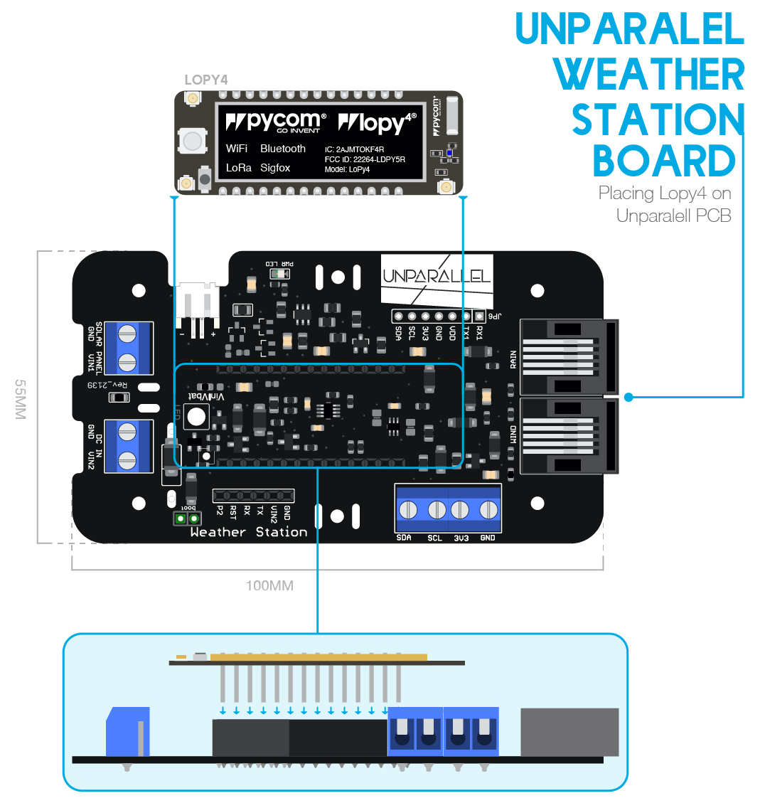

# Adding LoPy4 to the PCB

---

How to place Lopy4 on Unparallel PCB. Get the PCB ready to use and place the LoPy4 in top of that.

 

 

Be carefully and check where is the LoPy4 Led, this will help you to know their orientation.

 

 PCB weather station with LoPy4

